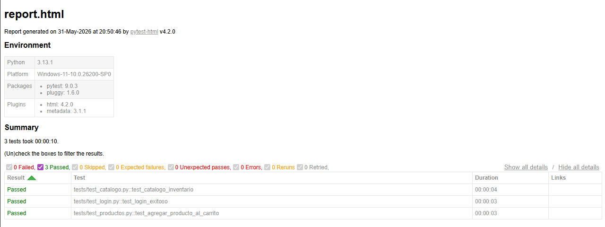

# Pre-entrega Automation Testing - SauceDemo

## Descripción del proyecto

Este proyecto corresponde a la pre-entrega del curso de Automation Testing de Talento Tech.

El objetivo es automatizar flujos básicos de navegación e interacción web utilizando Selenium WebDriver, Python y Pytest sobre el sitio demo:

https://www.saucedemo.com/

Las pruebas automatizadas verifican el login, la visualización del catálogo de productos y la interacción con el carrito de compras.

## Tecnologías utilizadas

- Python
- Selenium WebDriver
- Pytest
- Pytest HTML
- Google Chrome
- Git y GitHub

## Casos de prueba incluidos

### 1. Automatización de Login

Se valida que un usuario pueda iniciar sesión correctamente con credenciales válidas.

Validaciones realizadas:

- Navegación a la página de login.
- Ingreso de usuario y contraseña válidos.
- Redirección a `/inventory.html`.
- Validación del título del navegador `Swag Labs`.
- Validación del título visible `Products`.

### 2. Navegación y Verificación del Catálogo

Se valida que la página de inventario cargue correctamente luego del login.

Validaciones realizadas:

- Título correcto de la página de inventario.
- Presencia de productos visibles.
- Presencia de elementos principales de la interfaz, como menú, filtro y carrito.
- Obtención del nombre y precio del primer producto listado.

### 3. Interacción con Productos y Carrito

Se valida la interacción básica con el carrito de compras.

Validaciones realizadas:

- Agregado del primer producto al carrito.
- Verificación del contador del carrito.
- Navegación a la página del carrito.
- Confirmación de que el producto agregado aparece correctamente en el carrito.

## Estructura del proyecto

```text
pre-entrega/
│
├── tests/
│   ├── test_login.py
│   ├── test_catalogo.py
│   └── test_productos.py
│
├── utils/
│   ├── __init__.py
│   ├── config.py
│   ├── driver.py
│   ├── login.py
│   ├── catalogo.py
│   └── carrito.py
│
├── reports/
│   ├── report.html
│   └── report.png
│
├── README.md
└── .gitignore
```

## Instalación del proyecto

1. Clonar el repositorio:

```bash
git clone https://github.com/Nataliadiez/pre-entrega-automation-testing-natalia-diez
```

2. Ingresar a la carpeta del proyecto:

```bash
cd pre-entrega-automation-testing-natalia-diez
```

3. Instalar las dependencias necesarias:

```bash
python -m pip install selenium pytest pytest-html
```

## Ejecución de las pruebas

Para ejecutar todos los tests:

```bash
python -m pytest -v
```

Para ejecutar un test específico:

```bash
python -m pytest tests/test_login.py -v
```

```bash
python -m pytest tests/test_catalogo.py -v
```

```bash
python -m pytest tests/test_productos.py -v
```

## Generación del reporte HTML

Para ejecutar todas las pruebas y generar el reporte HTML:

```bash
python -m pytest -v --html=reports/report.html --self-contained-html
```

El reporte se genera en la siguiente ruta:

```text
reports/report.html
```

Para abrir el reporte en Windows desde la terminal:

```bash
start reports/report.html
```

## Captura del reporte HTML

Captura del reporte generado:

```md

```

## Resultado esperado

Al ejecutar la suite completa, se espera que los tres casos de prueba finalicen correctamente:

```text
tests/test_catalogo.py::test_catalogo_inventario PASSED
tests/test_login.py::test_login_exitoso PASSED
tests/test_productos.py::test_agregar_producto_al_carrito PASSED
```

## Autoría

Proyecto realizado como parte de la pre-entrega del curso de Automation Testing de Talento Tech.
